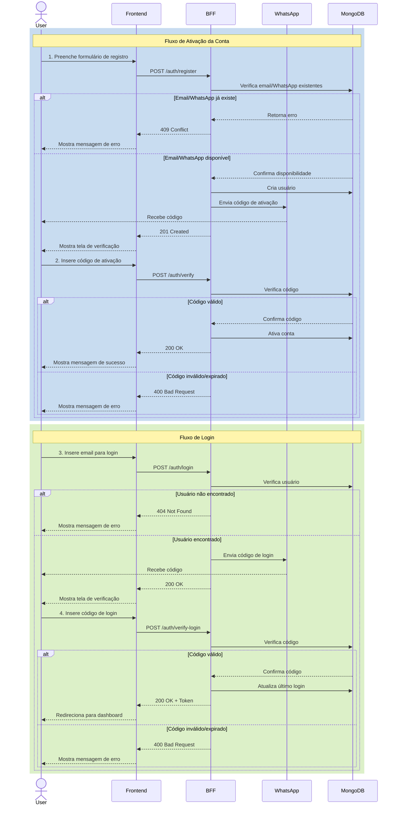

# Gwan BFF (Backend for Frontend)

Este projeto é o Backend for Frontend (BFF) da aplicação Gwan, servindo como uma camada de API intermediária entre o frontend React e os serviços backend.

## Arquitetura

O projeto segue o padrão de arquitetura Lean, com uma clara separação de responsabilidades:

```
src/
├── core/                    # Core do sistema
│   └── domain/
│       ├── entities/        # Entidades base
│       ├── repositories/    # Interfaces de repositório
│       ├── services/        # Serviços base
│       └── use-cases/       # Casos de uso base
│
├── modules/                 # Módulos da aplicação
│   └── hello/              # Exemplo de módulo
│       ├── domain/         # Regras de negócio
│       │   ├── entities/
│       │   ├── repositories/
│       │   ├── services/
│       │   └── use-cases/
│       ├── infrastructure/ # Implementações
│       │   ├── controllers/
│       │   └── repositories/
│       └── hello.module.ts
```

## Tecnologias

- NestJS
- TypeScript
- Docker
- MongoDB
- Swagger UI

## Desenvolvimento Local

### Pré-requisitos

- Node.js 20+
- Docker e Docker Compose
- Git
- MongoDB

### Instalação

1. Clone o repositório:
```bash
git clone https://github.com/rastamansp/gwan-bff-app.git
cd gwan-bff-app
```

2. Instale as dependências:
```bash
npm install
```

3. Inicie o ambiente de desenvolvimento:
```bash
# Usando npm
npm run start:dev

# Ou usando Docker
docker-compose -f docker-compose.dev.yml up -d
```

### API Documentation

A documentação da API está disponível através do Swagger UI em:
```
http://localhost:3000/api
```

#### Fluxo de Autenticação

O fluxo de autenticação é dividido em duas partes principais:

1. **Ativação da Conta**
   - Registro do usuário
   - Verificação do código de ativação

2. **Login**
   - Solicitação de login
   - Verificação do código de login



##### 1. Registro de Usuário
```http
POST /auth/register
Content-Type: application/json

{
  "name": "Pedro Almeida",
  "email": "pedro.hp.almeida@gmail.com",
  "whatsapp": "+5511999999999"
}
```
- Cria um novo usuário
- Gera um código de ativação
- Envia o código por WhatsApp
- Retorna o ID do usuário

**Possíveis Erros:**
```json
{
  "statusCode": 409,
  "message": "Email já está em uso",
  "code": "EMAIL_ALREADY_EXISTS",
  "details": {
    "email": "pedro.hp.almeida@gmail.com"
  }
}
```
```json
{
  "statusCode": 409,
  "message": "WhatsApp já está em uso",
  "code": "WHATSAPP_ALREADY_EXISTS",
  "details": {
    "whatsapp": "+5511999999999"
  }
}
```

##### 2. Verificação de Código de Ativação
```http
POST /auth/verify
Content-Type: application/json

{
  "email": "pedro.hp.almeida@gmail.com",
  "code": "123456"
}
```
- Verifica o código de ativação
- Ativa a conta do usuário
- Retorna o usuário ativado

**Possíveis Erros:**
```json
{
  "statusCode": 404,
  "message": "Usuário não encontrado",
  "code": "USER_NOT_FOUND",
  "details": {
    "email": "pedro.hp.almeida@gmail.com"
  }
}
```
```json
{
  "statusCode": 400,
  "message": "Código de ativação não encontrado",
  "code": "ACTIVATION_CODE_NOT_FOUND",
  "details": {
    "email": "pedro.hp.almeida@gmail.com"
  }
}
```
```json
{
  "statusCode": 400,
  "message": "Código de ativação inválido",
  "code": "INVALID_ACTIVATION_CODE",
  "details": {
    "email": "pedro.hp.almeida@gmail.com",
    "providedCode": "123456"
  }
}
```
```json
{
  "statusCode": 400,
  "message": "Código de ativação expirado",
  "code": "ACTIVATION_CODE_EXPIRED",
  "details": {
    "email": "pedro.hp.almeida@gmail.com",
    "expiresAt": "2025-04-27T20:24:18.000Z"
  }
}
```

##### 3. Login
```http
POST /auth/login
Content-Type: application/json

{
  "email": "pedro.hp.almeida@gmail.com"
}
```
- Verifica se o usuário está ativado
- Gera um código de login
- Envia o código por WhatsApp
- Retorna o usuário

**Possíveis Erros:**
```json
{
  "statusCode": 404,
  "message": "Usuário não encontrado",
  "code": "USER_NOT_FOUND",
  "details": {
    "email": "pedro.hp.almeida@gmail.com"
  }
}
```
```json
{
  "statusCode": 400,
  "message": "Usuário não está verificado",
  "code": "USER_NOT_VERIFIED",
  "details": {
    "email": "pedro.hp.almeida@gmail.com"
  }
}
```

##### 4. Verificação de Código de Login
```http
POST /auth/verify-login
Content-Type: application/json

{
  "email": "pedro.hp.almeida@gmail.com",
  "code": "123456"
}
```
- Verifica o código de login
- Atualiza a data do último login
- Retorna o token de acesso

**Possíveis Erros:**
```json
{
  "statusCode": 404,
  "message": "Usuário não encontrado",
  "code": "USER_NOT_FOUND",
  "details": {
    "email": "pedro.hp.almeida@gmail.com"
  }
}
```
```json
{
  "statusCode": 400,
  "message": "Código de login não encontrado",
  "code": "LOGIN_CODE_NOT_FOUND",
  "details": {
    "email": "pedro.hp.almeida@gmail.com"
  }
}
```
```json
{
  "statusCode": 400,
  "message": "Código de login inválido",
  "code": "INVALID_LOGIN_CODE",
  "details": {
    "email": "pedro.hp.almeida@gmail.com",
    "providedCode": "123456"
  }
}
```
```json
{
  "statusCode": 400,
  "message": "Código de login expirado",
  "code": "LOGIN_CODE_EXPIRED",
  "details": {
    "email": "pedro.hp.almeida@gmail.com",
    "expiresAt": "2025-04-27T20:24:18.000Z"
  }
}
```

#### Exemplo de Uso

```typescript
// 1. Registrar um novo usuário
const registerResponse = await fetch('http://localhost:3000/auth/register', {
  method: 'POST',
  headers: { 'Content-Type': 'application/json' },
  body: JSON.stringify({
    name: 'Pedro Almeida',
    email: 'pedro.hp.almeida@gmail.com',
    whatsapp: '+5511999999999'
  })
});

// 2. Verificar o código de ativação
const verifyResponse = await fetch('http://localhost:3000/auth/verify', {
  method: 'POST',
  headers: { 'Content-Type': 'application/json' },
  body: JSON.stringify({
    email: 'pedro.hp.almeida@gmail.com',
    code: '123456' // Código de ativação recebido por WhatsApp
  })
});

// 3. Solicitar login
const loginResponse = await fetch('http://localhost:3000/auth/login', {
  method: 'POST',
  headers: { 'Content-Type': 'application/json' },
  body: JSON.stringify({
    email: 'pedro.hp.almeida@gmail.com'
  })
});

// 4. Verificar o código de login
const verifyLoginResponse = await fetch('http://localhost:3000/auth/verify-login', {
  method: 'POST',
  headers: { 'Content-Type': 'application/json' },
  body: JSON.stringify({
    email: 'pedro.hp.almeida@gmail.com',
    code: '123456' // Código de login recebido por WhatsApp
  })
});
```

### Endpoints

#### Autenticação

- `POST /auth/register`: Registra um novo usuário
- `POST /auth/verify`: Verifica o código de ativação
- `POST /auth/login`: Solicita login
- `POST /auth/verify-login`: Verifica o código de login

## Produção

### Deploy

O projeto está configurado para ser implantado através do Portainer:

1. Acesse o Portainer
2. Vá para a seção "Stacks"
3. Crie uma nova stack ou atualize a existente
4. Cole o conteúdo do `docker-compose.yml`
5. Clique em "Deploy the stack"

### Variáveis de Ambiente

- `NODE_ENV`: Ambiente (development/production)
- `PORT`: Porta da aplicação (padrão: 3000)
- `MONGODB_URI`: URI de conexão com o MongoDB
- Mais variáveis serão adicionadas conforme necessário

## Integração com Frontend

Este BFF serve como uma camada de API para o frontend React (`gwan-site`). Principais benefícios:

1. **Segurança**:
   - Apenas o BFF é exposto à internet
   - Autenticação e autorização centralizadas
   - Proteção contra ataques

2. **Performance**:
   - Agregação de dados
   - Cache de respostas
   - Otimização de payload

3. **Manutenibilidade**:
   - Separação clara de responsabilidades
   - Fácil adicionar novas funcionalidades
   - Código organizado e testável

## Contribuição

1. Crie uma branch para sua feature:
```bash
git checkout -b feature/nova-feature
```

2. Faça commit das alterações:
```bash
git commit -m "feat: Adiciona nova feature"
```

3. Envie para o repositório:
```bash
git push origin feature/nova-feature
```

4. Crie um Pull Request

## Licença

Este projeto é privado e confidencial. Todos os direitos reservados. 