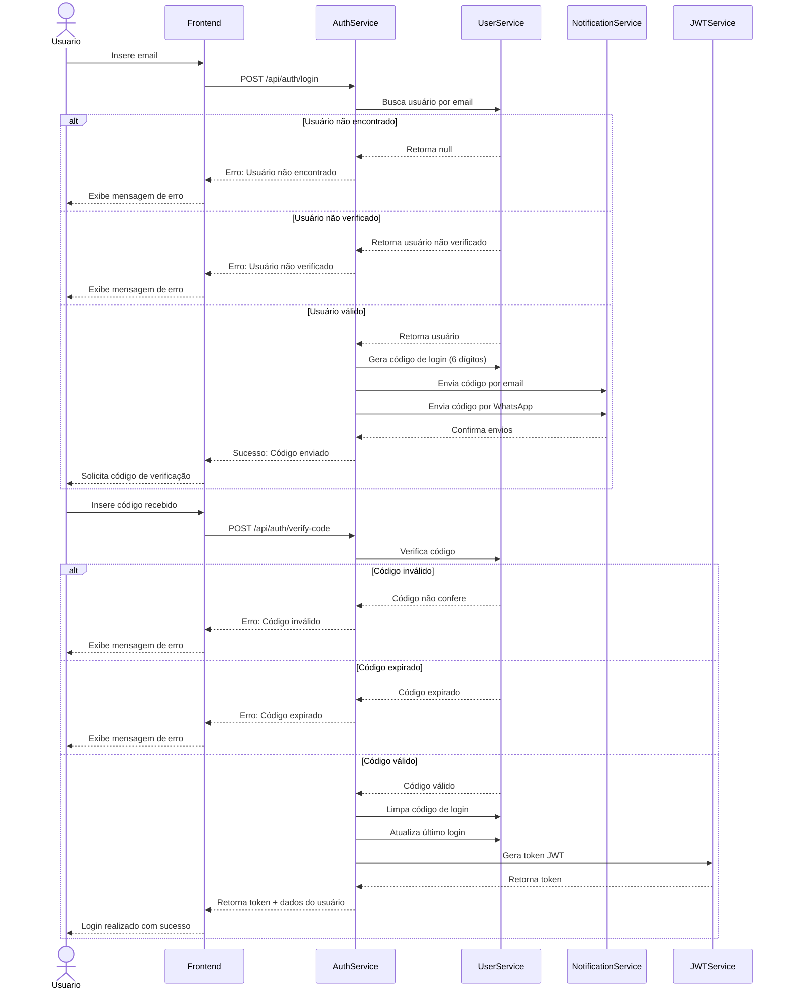

# API de Autenticação

Esta documentação descreve os endpoints e o fluxo de autenticação do sistema GWAN.

## 🔄 Fluxo de Autenticação

O sistema utiliza autenticação em duas etapas (2FA) através de códigos enviados por email e WhatsApp. Abaixo está o diagrama detalhado do fluxo:



## 📡 Endpoints

### Registro de Usuário
`POST /auth/register`

Registra um novo usuário no sistema.

#### Request Body
```json
{
  "email": "usuario@exemplo.com",
  "password": "Senha@123",
  "name": "Nome do Usuário",
  "whatsapp": "5511999999999"
}
```

#### Response (201 Created)
```json
{
  "message": "Verifique seu email e WhatsApp",
  "userId": "507f1f77bcf86cd799439011"
}
```

#### Erros
- `400 Bad Request`: Dados inválidos
- `409 Conflict`: Email já cadastrado

### Login
`POST /auth/login`

Inicia o processo de login enviando código de verificação.

#### Request Body
```json
{
  "email": "usuario@exemplo.com"
}
```

#### Response (200 OK)
```json
{
  "message": "Código de verificação enviado",
  "expiresIn": 600
}
```

#### Erros
- `401 Unauthorized`: Usuário não encontrado
- `403 Forbidden`: Usuário não verificado

### Verificação de Código
`POST /auth/verify-code`

Verifica o código de login e retorna o token JWT.

#### Request Body
```json
{
  "email": "usuario@exemplo.com",
  "code": "123456"
}
```

#### Response (200 OK)
```json
{
  "accessToken": "eyJhbGciOiJIUzI1NiIs...",
  "user": {
    "id": "507f1f77bcf86cd799439011",
    "email": "usuario@exemplo.com",
    "name": "Nome do Usuário",
    "isVerified": true
  }
}
```

#### Erros
- `401 Unauthorized`: Código inválido ou expirado
- `404 Not Found`: Usuário não encontrado

## 🔒 Segurança

### JWT (JSON Web Token)
- Algoritmo: HS256
- Expiração: 24 horas
- Claims: sub (userId), email, role

### Políticas de Senha
- Mínimo 8 caracteres
- Pelo menos uma letra maiúscula
- Pelo menos uma letra minúscula
- Pelo menos um número
- Pelo menos um caractere especial

### Rate Limiting
- Login: 5 tentativas por minuto
- Verificação: 3 tentativas por minuto
- Registro: 3 tentativas por hora

## ⚙️ Configurações

### Código de Verificação
```typescript
interface VerificationCode {
  code: string;           // Código de 6 dígitos
  expiresAt: Date;        // Expira em 10 minutos
  attempts: number;       // Tentativas restantes
}
```

### Token JWT
```typescript
interface JwtPayload {
  sub: string;           // ID do usuário
  email: string;         // Email do usuário
  role: string;          // Papel do usuário
  iat: number;           // Data de emissão
  exp: number;           // Data de expiração
}
```

## 📚 Considerações de Implementação

### Clean Architecture
- Value Objects para Email e Password
- Casos de uso isolados
- Repositórios abstratos
- Serviços de domínio

### Tratamento de Erros
- Erros específicos do domínio
- Mensagens claras e descritivas
- Logs estruturados
- Rastreamento de operações

### Logging
- Nível: DEBUG para operações de autenticação
- Campos: userId, email, operation, status
- Rastreamento de tentativas
- Monitoramento de falhas

## 📊 Monitoramento

### Métricas
- Taxa de sucesso de login
- Tempo médio de autenticação
- Taxa de falha por motivo
- Uso de códigos de verificação

### Alertas
- Múltiplas tentativas de login
- Taxa de erro acima do normal
- Falhas no envio de códigos
- Tentativas de força bruta

## 📚 Próximos Passos

- [API de Profile](profile.md)
- [API de Users](users.md)
- [Guia de Desenvolvimento](../development/guide.md)
- [Monitoramento](../monitoring/metrics.md) 


