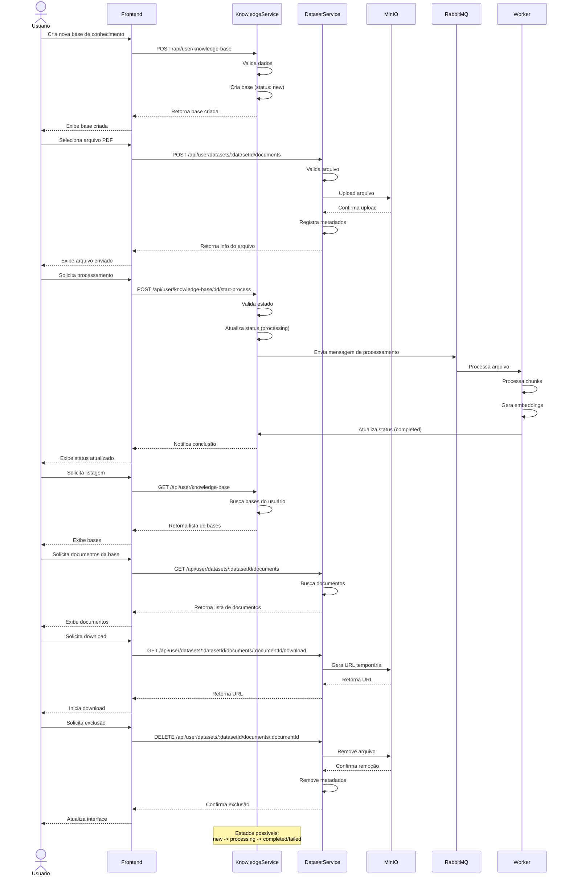

# API de Knowledge Base

Esta documentação descreve os endpoints disponíveis para gerenciamento de bases de conhecimento com o novo fluxo separado de upload e processamento.

## 🔐 Autenticação

Todos os endpoints requerem autenticação via JWT. O token deve ser enviado no header:

```
Authorization: Bearer <token>
```

## 📋 Fluxo Completo

### 1. Criar Base → 2. Upload Arquivo → 3. Iniciar Processamento → 4. Consultar Status

## 📡 Endpoints

### 1. Criar Knowledge Base
`POST /user/knowledge-base`

Cria uma nova base de conhecimento (apenas nome e descrição).

#### Request Body
```json
{
  "name": "Base de Suporte Técnico",
  "description": "Base contendo manuais e documentação técnica"
}
```

#### Response (201 Created)
```json
{
  "_id": "507f1f77bcf86cd799439011",
  "userId": "507f1f77bcf86cd799439012",
  "name": "Base de Suporte Técnico",
  "description": "Base contendo manuais e documentação técnica",
  "status": "created",
  "fileCount": 0,
  "createdAt": "2024-03-21T10:00:00.000Z",
  "updatedAt": "2024-03-21T10:00:00.000Z"
}
```

#### Erros
- `400 Bad Request`: Dados inválidos fornecidos
- `401 Unauthorized`: Não autorizado

### 2. Upload de Arquivo
`POST /user/files/upload`

Faz upload de arquivo PDF para MinIO e vincula à base de conhecimento.

#### Request Body (multipart/form-data)
- `file`: Arquivo PDF (máximo 5MB)
- `knowledgeBaseId`: ID da base de conhecimento

#### Response (201 Created)
```json
{
  "fileId": "507f1f77bcf86cd799439014",
  "filename": "manual_usuario.pdf",
  "originalName": "Manual do Usuário.pdf",
  "size": 2048576,
  "mimeType": "application/pdf",
  "bucketPath": "user123/knowledge-base/kb456/20240321-manual_usuario.pdf",
  "status": "uploaded",
  "knowledgeBaseId": "507f1f77bcf86cd799439011",
  "createdAt": "2024-03-21T10:05:00.000Z"
}
```

#### Erros
- `400 Bad Request`: Arquivo inválido, muito grande ou formato não suportado
- `401 Unauthorized`: Não autorizado
- `404 Not Found`: Base de conhecimento não encontrada

### 3. Listar Knowledge Bases
`GET /user/knowledge-base`

Lista todas as bases de conhecimento do usuário.

#### Query Parameters
- `page` (opcional): Número da página (default: 1)
- `limit` (opcional): Itens por página (default: 10)
- `status` (opcional): Filtrar por status (created, active, processing, error)

#### Response (200 OK)
```json
{
  "data": [
    {
      "_id": "507f1f77bcf86cd799439011",
      "name": "Base de Suporte Técnico",
      "description": "Base contendo manuais e documentação técnica",
      "status": "active",
      "fileCount": 3,
      "createdAt": "2024-03-21T10:00:00.000Z",
      "updatedAt": "2024-03-21T10:00:00.000Z"
    }
  ],
  "meta": {
    "total": 1,
    "page": 1,
    "limit": 10,
    "pages": 1
  }
}
```

### 4. Obter Knowledge Base por ID
`GET /user/knowledge-base/:id`

Obtém detalhes de uma base de conhecimento específica incluindo arquivos.

#### Response (200 OK)
```json
{
  "_id": "507f1f77bcf86cd799439011",
  "userId": "507f1f77bcf86cd799439012",
  "name": "Base de Suporte Técnico",
  "description": "Base contendo manuais e documentação técnica",
  "status": "active",
  "fileCount": 3,
  "files": [
    {
      "fileId": "507f1f77bcf86cd799439014",
      "filename": "manual_usuario.pdf",
      "originalName": "Manual do Usuário.pdf",
      "size": 2048576,
      "status": "processed",
      "uploadedAt": "2024-03-21T10:05:00.000Z",
      "processedAt": "2024-03-21T10:08:00.000Z"
    }
  ],
  "createdAt": "2024-03-21T10:00:00.000Z",
  "updatedAt": "2024-03-21T10:00:00.000Z",
  "stats": {
    "totalChunks": 150,
    "totalTokens": 45000,
    "lastProcessed": "2024-03-21T10:08:00.000Z"
  }
}
```

#### Erros
- `401 Unauthorized`: Não autorizado
- `404 Not Found`: Base de conhecimento não encontrada

### 5. Iniciar Processamento
`POST /user/knowledge-base/:id/start-process`

Inicia o processamento assíncrono de um arquivo via RabbitMQ.

#### Request Body
```json
{
  "fileId": "507f1f77bcf86cd799439014"
}
```

#### Response (202 Accepted)
```json
{
  "message": "Processamento iniciado",
  "queueId": "process_507f1f77bcf86cd799439015",
  "estimatedTime": "2-5 minutos",
  "status": "queued"
}
```

#### Erros
- `400 Bad Request`: Arquivo não encontrado ou já processado
- `401 Unauthorized`: Não autorizado
- `404 Not Found`: Base de conhecimento ou arquivo não encontrado

### 6. Listar Arquivos
`GET /user/files`

Lista todos os arquivos do usuário.

#### Query Parameters
- `knowledgeBaseId` (opcional): Filtrar por base de conhecimento
- `status` (opcional): Filtrar por status (uploaded, processing, processed, failed)

#### Response (200 OK)
```json
{
  "data": [
    {
      "fileId": "507f1f77bcf86cd799439014",
      "filename": "manual_usuario.pdf",
      "originalName": "Manual do Usuário.pdf",
      "size": 2048576,
      "mimeType": "application/pdf",
      "status": "processed",
      "knowledgeBaseId": "507f1f77bcf86cd799439011",
      "knowledgeBaseName": "Base de Suporte Técnico",
      "uploadedAt": "2024-03-21T10:05:00.000Z",
      "processedAt": "2024-03-21T10:08:00.000Z"
    }
  ]
}
```

### 7. Remover Arquivo
`DELETE /user/files/:fileId`

Remove um arquivo do MinIO e todos os dados relacionados do MongoDB.

#### Response (200 OK)
```json
{
  "message": "Arquivo removido com sucesso"
}
```

#### Erros
- `401 Unauthorized`: Não autorizado
- `404 Not Found`: Arquivo não encontrado

### 8. Atualizar Knowledge Base
`PUT /user/knowledge-base/:id`

Atualiza as informações de uma base de conhecimento.

#### Request Body
```json
{
  "name": "Base de Suporte Técnico Atualizada",
  "description": "Nova descrição da base"
}
```

#### Response (200 OK)
```json
{
  "_id": "507f1f77bcf86cd799439011",
  "name": "Base de Suporte Técnico Atualizada",
  "description": "Nova descrição da base",
  "updatedAt": "2024-03-21T16:00:00.000Z"
}
```

### 9. Remover Knowledge Base
`DELETE /user/knowledge-base/:id`

Remove uma base de conhecimento e todos os arquivos associados.

#### Response (200 OK)
```json
{
  "message": "Base de conhecimento removida com sucesso",
  "removedFiles": 3
}
```

#### Erros
- `401 Unauthorized`: Não autorizado
- `404 Not Found`: Base de conhecimento não encontrada

## 🔄 RabbitMQ - Processamento Assíncrono

### Mensagem enviada para fila
```json
{
  "action": "process_document",
  "userId": "507f1f77bcf86cd799439012",
  "knowledgeBaseId": "507f1f77bcf86cd799439011",
  "fileId": "507f1f77bcf86cd799439014",
  "priority": "normal",
  "timestamp": "2024-03-21T10:06:00.000Z"
}
```

### Status do processamento
- `queued`: Na fila aguardando processamento
- `processing`: Sendo processado pelo worker
- `completed`: Processamento concluído com sucesso
- `failed`: Falha no processamento

## 📁 Estrutura MinIO

```
bucket-name/
  └── {userId}/
      └── knowledge-base/
          └── {knowledgeBaseId}/
              └── {timestamp}-{filename}.pdf
```

## 🗄️ MongoDB Schemas

### KnowledgeBase
```javascript
{
  _id: ObjectId,
  userId: ObjectId,
  name: String,
  description: String,
  status: String, // created, active, processing, error
  fileCount: Number,
  createdAt: Date,
  updatedAt: Date
}
```

### File
```javascript
{
  _id: ObjectId,
  userId: ObjectId,
  knowledgeBaseId: ObjectId,
  filename: String,
  originalName: String,
  size: Number,
  mimeType: String,
  bucketPath: String,
  status: String, // uploaded, processing, processed, failed
  uploadedAt: Date,
  processedAt: Date
}
```

### Document (chunks processados)
```javascript
{
  _id: ObjectId,
  fileId: ObjectId,
  chunks: [String],
  embeddings: [Array],
  metadata: Object,
  processedAt: Date
}
```

## Fluxo de Operações



## Endpoints

### Base de Conhecimento

| Método | Endpoint | Descrição |
|--------|----------|-----------|
| POST | `/api/user/knowledge-base` | Cria uma nova base de conhecimento |
| GET | `/api/user/knowledge-base` | Lista todas as bases de conhecimento do usuário |
| GET | `/api/user/knowledge-base/:id` | Obtém detalhes de uma base específica |
| POST | `/api/user/knowledge-base/:id/start-process` | Inicia o processamento da base |

### Documentos

| Método | Endpoint | Descrição |
|--------|----------|-----------|
| POST | `/api/user/datasets/:datasetId/documents` | Upload de documento para um dataset |
| GET | `/api/user/datasets/:datasetId/documents` | Lista documentos de um dataset |
| GET | `/api/user/datasets/:datasetId/documents/:documentId/download` | Gera URL para download do documento |
| DELETE | `/api/user/datasets/:datasetId/documents/:documentId` | Remove um documento do dataset |

## Estados da Base de Conhecimento

- **new**: Base recém-criada, aguardando documentos
- **processing**: Base em processamento
- **completed**: Processamento concluído com sucesso
- **failed**: Falha no processamento

## Notas de Implementação

1. **Autenticação**: Todos os endpoints requerem autenticação JWT
2. **Upload de Arquivos**: 
   - Suporta arquivos PDF
   - Tamanho máximo: 10MB
   - Validação de tipo MIME
3. **Processamento**:
   - Assíncrono via RabbitMQ
   - Notificações de progresso
   - Retry automático em caso de falha
4. **Segurança**:
   - URLs temporárias para download
   - Validação de propriedade dos recursos
   - Sanitização de nomes de arquivo

## Exemplos de Uso

### Upload de Documento

```http
POST /api/user/datasets/123/documents
Content-Type: multipart/form-data
Authorization: Bearer <token>

file: <arquivo_pdf>
```

### Listar Documentos

```http
GET /api/user/datasets/123/documents
Authorization: Bearer <token>
```

### Download de Documento

```http
GET /api/user/datasets/123/documents/456/download
Authorization: Bearer <token>
```

### Excluir Documento

```http
DELETE /api/user/datasets/123/documents/456
Authorization: Bearer <token>
``` 